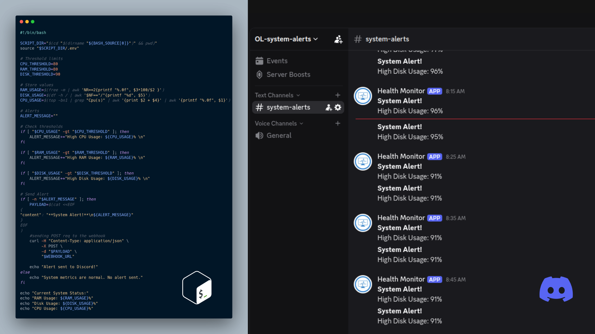
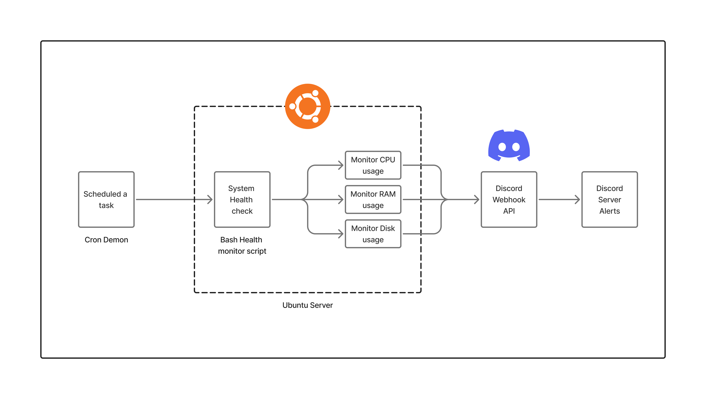

# System Health Monitor - Discord Alerts


A lightweight, automated Bash script that monitors server health (CPU, RAM, and Disk usage) and sends near-instant alerts to a Discord channel via Webhooks when predefined thresholds are crossed. 

Designed for TechOps and System Administrators who need simple, agentless monitoring without relying on heavy external services.

## Features
* **Agentless & Lightweight:** Uses core Linux utilities (`top`, `free`, `df`, `awk`).
* **Automated Scheduling:** Runs seamlessly in the background using `cron`.
* **Secure Credential Storage:** Uses a `.env` file to keep Discord Webhook URLs safe.
* **Instant Notifications:** Formats alerts into clear JSON payloads and pushes them directly to your team's Discord server.

## Prerequisites
* A Linux-based OS (Tested on Ubuntu)
* A Discord Webhook URL (Create one in your Discord Server -> Channel Settings -> Integrations -> Webhooks)
* Standard utilities installed: `bash`, `curl`, `awk`

## Installation & Setup

Follow these steps to set up the monitor on your local machine or server.

**1. Clone the repository**
```bash
git clone https://github.com/nknaleena101/Linux-System-Alert-for-Discord.git
cd Linux-System-Alert-for-Discord
```

**2. Setup Environment Variables**
For security, the Webhook URL is not hardcoded. We use a `.env` file. 
Copy the provided example file to create your local environment file:
```bash
cp .env.example .env
```
Next, open `.env` using your preferred text editor (e.g., `nano .env`) and add your Discord Webhook URL:
```env
WEBHOOK_URL="https://discord.com/api/webhooks/YOUR_ID/YOUR_TOKEN"
```
*Note: Make sure to keep your `.env` file private and never commit it to version control (it should be in your `.gitignore`).*

**3. Make the script executable**
Grant the necessary execution permissions to the Bash script:
```bash
chmod +x monitor.sh
```

##  Usage & Testing

You can manually test the script at any time to verify it works and can communicate with Discord:
```bash
./monitor.sh
```
*Tip: To test the Discord alert delivery, temporarily lower the threshold variables inside `monitor.sh` (e.g., set `CPU_THRESHOLD=1`) and run the script manually.*

##  Automation with Cron

To achieve true automation, schedule the script to run periodically using the Linux `cron` daemon.

1. Open your crontab configuration:
```bash
crontab -e
```
2. Add the following line at the bottom of the file to run the check every 5 minutes. **Crucial: You must use absolute paths.** Replace `/path/to/your/folder/` with your actual directory path:
```cron
*/5 * * * * /path/to/your/folder/monitor.sh >> /path/to/your/folder/monitor.log 2>&1
```
3. Save and exit. The script is now fully automated! Check `monitor.log` for execution history and troubleshooting.

##  Customization
You can easily adjust the alert thresholds by modifying the variables at the top of `monitor.sh`:
```bash
CPU_THRESHOLD=80   # Alert if CPU usage is > 80%
RAM_THRESHOLD=80   # Alert if RAM usage is > 80%
DISK_THRESHOLD=90  # Alert if Disk usage is > 90%
```

##  Architecture

*This script extracts hardware metrics from the Linux kernel, evaluates them against defined limits, and utilizes `curl` to push an alert payload to the Discord REST API.*
